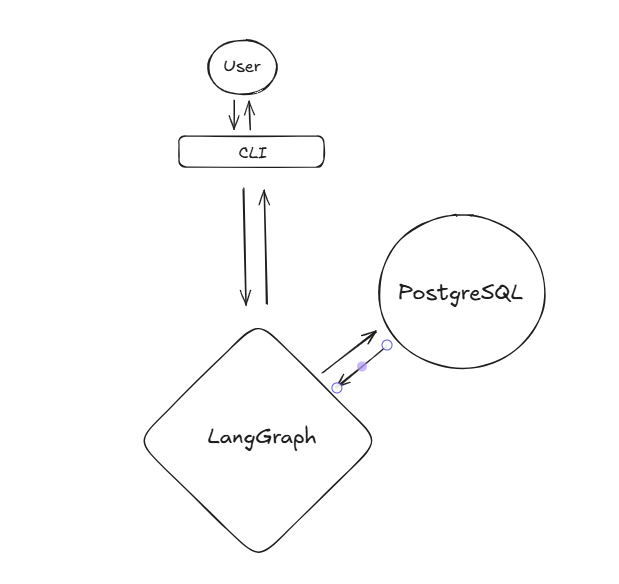

# Orbi — Intelligent Travel Assistant

I built Orbi to solve a problem I kept running into as a traveler: planning a trip takes too much time and too many websites.

Orbi brings scattered travel information into one place, with a clear focus on **planning**.


---

## ✨ High-Level Overview

Orbi is built as a **LangGraph-driven conversational system** that:

- Maintains **conversation state across turns and sessions** using PostgreSQL
- Dynamically decides when to rely on:
  - Pure LLM reasoning
  - External APIs
  - Multi-step tool-assisted execution
- Integrates **multiple real-world data sources** for factual grounding
- Actively **detects and prevents hallucinations** using a dedicated verifier model
- Please note that currently Orbi always continues previous conversation

The assistant is exposed via a **CLI interface**.

---

## 🧠 Assistant Purpose & Capabilities

**Primary domain:** Travel planning & decision support

Orbi currently supports the following type of queries (individually, or combined, in any phrasing):

### 1️⃣ Weather & Climate
- *“What’s the weather like in Paris in October?”*

### 2️⃣ Activities & Recommendations
- *“What are the best things to do in Tokyo?”*

### 3️⃣ Flight Search
- *“find me flights from tel aviv to athens tomorrow.”*

### 4️⃣ Time-Based Queries
- *“What time will it be in Tokyo when I land in 8 hours?”*

### 5️⃣ Travel Warnings & Safety
- *“Is it safe to travel to Ireland right now?”*

### 6️⃣ Israeli Foreign Missions
- *“I lost my passport in Delhi - who should I contact?”*

### 7️⃣ Entry Requirements
- *“What are the entry requirements for Mexico if I hold a Polish passport?”*

---

## 🗂️ System Architecture

Orbi is implemented as a **LangGraph execution graph**, where each node has a **explicit responsibility**.


### Architecture Diagrams




---

### Technology Stack

- **LLMs**
  - Claude Sonnet 4.5 — summarize node
  - Gemini Flash 2.5 — verifier node
  - Claude Haiku 4.5 — all other graph nodes
- **Database**: PostgreSQL 16
- **Orchestration**: LangGraph
- **Observability**: LangSmith (development only)
- **Containerization**: Docker 4.4.48
- **External Data Sources**: Open-Meteo, Amadeus, Data.gov.il, Travel-buddy

---

## 📁 Code Structure

```text
app/
├── cache/            # Cached API responses to reduce latency & rate-limit pressure
├── config/           # Configuration & environment settings
├── data/             # Static datasets (e.g. country mappings)
├── domain/           # Pure domain logic (no LLM)
├── graph/            # Graph state, initialization, and wiring
├── infrastructure/   # LLM singletons & external API clients
├── nodes/            # LangGraph nodes (such ash router, executor, verifier, finalizer)
├── tools/            # LangChain tool wrappers around domain functions
└── main.py           # CLI entry point

tests/
├── Mirrors the `app/` package structure for clear ownership and traceability
├── Follows the `test_<file_name>.py` naming convention
└── Emphasizes contract and unit testing and selective end-to-end smoke coverage

```

---

## 🔄 System Flow (Step by Step)

### 1️⃣ User Input

* The user interacts via a CLI.
* Each message is appended to the graph state.
* Conversation state is kept in memory, and persisted via a **LangGraph checkpointer (PostgreSQL)**.

---

### 2️⃣ Context Summarization (Token Control)

When accumulated messages exceed a configurable threshold:

* A summarization node condenses prior context
* Token usage is reduced while preserving semantic intent
* This prevents context explosion and controls latency/cost

---

### 3️⃣ Routing Decision (Guardrail)

A dedicated **router node** classifies each request as:

* **OFF_TOPIC** — outside the assistant’s scope
* **DIRECT** — can be answered from conversation history alone
* **PLAN** (default) — requires reasoning, tools, or external data

Routing is guided by:

* Explicit prompt rules
* Deterministic heuristics
* Defensive defaults (favoring safety over hallucination)

---

### 4️⃣ External Data Integration

When required, the executor invokes external APIs such as:

* **Travel warnings**
* **Climate & weather**
* **Flight search**
* **Time & timezone data**

Key principles:

* API data is explicitly injected into the LLM prompt
* Cached where feasible to reduce latency
* Tool usage is enforced by prompt rules

---

### 5️⃣ Response Generation

The main LLM generates an answer using:

* Conversation context
* Retrieved factual data
* Prompt constraints designed to minimize speculation

Only the **final user-facing answer** is returned.

---

### 6️⃣ Hallucination Verification

A **separate verifier LLM** evaluates the response:

* Is the answer consistent with the user’s question?
* Is it plausible given general world knowledge?
* Are there signs of unsupported claims?

Verifier characteristics:

* Deterministic (temperature = 0)
* Validation-only (no generation)
* reasoning model

---

### 7️⃣ Finalization

Based on verifier feedback, the system may:

* Add transparency or uncertainty notes
* Flag weak grounding
* Warn the user when confidence is low

---

## 🧪 Hallucination Mitigation Strategy

Hallucination control is handled across multiple layers:

### Prompt-Level Controls

* Explicit separation of facts vs. estimates
* Internal reasoning constraints
* Reduced speculative language

### Tool-Usage Enforcement

* Clear rules for when tools **must** be invoked
* Post-generation checks to ensure compliance

### Verifier Model

* Independent validation model
* Focused solely on correctness and coherence

---

## 🔮 Future Improvements


### Architecture & Code Quality

- Fully asynchronous design to support concurrent clients and scalable deployment
- Secure communication with PostgreSQL
- Centralized caching management
- Controlled and concise chatbot responses to reduce verbosity
- Strongly typed contracts using Pydantic and dataclasses for node and domain function outputs
- Comprehensive unit and smoke test coverage
- End-to-end logging coverage across the system
- Expanded caching strategy for improved performance and resilience
- Built-in retry and recovery flows within the graph to handle failures and mitigate detected hallucinations

### Expanded Travel Capabilities

For example:

* Vaccination recommendations
* End-to-end trip cost estimation:
  * Flights
  * Accommodation
  * Food
  * Transportation
  * Insurance & activities
* Action-oriented flows (booking, reservations)


### Product & UX

* Web-based UI
* Hebrew language support
* Voice interaction
* Persistent user preferences ("long term memory")
* User management
* Choose Start a new conversation or Continue an existing one

---


## Running Orbi

Orbi can be run either **inside Docker** or **locally using `uv`**.  
Both modes use the same environment configuration.

---

## Initial Setup


Clone the Repository:

```bash
git clone https://github.com/Wex47/Orbi.git
cd Orbi
``` 

In addition, Orbi requires a `.env` file in the project root.

Create a file named `.env` with the following contents:

```env
# LLM Providers
GOOGLE_API_KEY=your_google_api_key
ANTHROPIC_API_KEY=your_anthropic_api_key

# RapidAPI (entry requirements)
RAPIDAPI_KEY=your_key

# Amadeus (Flights, recommendations)
AMADEUS_API_KEY=your_key
AMADEUS_API_SECRET=your_secret

# PostgreSQL
POSTGRES_HOST=<your-docker-host>
POSTGRES_PORT=5432
POSTGRES_USER=user
POSTGRES_PASSWORD=password
POSTGRES_DB=orbi
````

> **Docker users:**
> If PostgreSQL is running on your host machine, set
> `POSTGRES_HOST=host.docker.internal`.


---

## Option A — Run with Docker

from the project root directory:

### 1️⃣ Build the Docker Image

```bash
docker build -t orbi:latest .
```

---

### 2️⃣ Run Orbi

```bash
docker run -it --env-file .env orbi:latest
```

Expected output:

```text
Welcome to Orbi! Type 'exit' or 'quit' to leave.
[thread_id=...]
You:
```

---

## Option B — Run Locally with `uv`

Use this option if you prefer running Orbi directly on your machine.

### 1️⃣ Install `uv`

**macOS / Linux**

```bash
curl -LsSf https://astral.sh/uv/install.sh | sh
```

**Windows (PowerShell)**

```powershell
powershell -c "irm https://astral.sh/uv/install.ps1 | iex"
```

Verify:

```bash
uv --version
```


---

### 2️⃣ Install Dependencies

```bash
uv sync
```

Creates an isolated virtual environment using `pyproject.toml` and `uv.lock`.

---

### 3️⃣ Run the Assistant

```bash
uv run python -m app.main
```

Expected output:

```text
[thread_id=...] (set THREAD_ID env var to resume)

You:
```

---

## Example Queries

```text
Is April a good time to visit Tokyo?
What’s the weather like in Paris in October?
What flights are available from Tel Aviv to Tokyo on December 28, 2025?
What time will it be in Tokyo in 8 hours?
```

---

No further setup is required.
