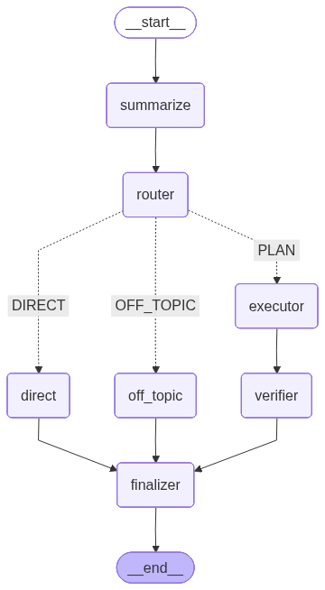

# Orbi - Intelligent Travel Assistant

Orbi was created to address a pain point I frequently encounter as a travel enthusiast.
its focus is **Planning**.

---

## ✨ High-Level Overview

Orbi is built as a **LangGraph-driven conversational system** that:

- Maintains **conversation state across turns and sessions** using PostgreSQL
- Dynamically decides when to rely on:
  - Pure LLM reasoning
  - External APIs
  - Multi-step tool-assisted execution
- Integrates **multiple real-world data sources** for factual grounding
- Actively **detects and prevents hallucinations** using a dedicated verifier model

The assistant is exposed via a **CLI interface**.

---

## 🧠 Assistant Purpose & Capabilities

**Primary domain:** Travel planning & decision support

Orbi supports the following categories of queries (individually or combined):

### 1️⃣ Weather & Climate
- *“Is April a good time to visit Tokyo?”*
- *“What’s the weather like in Paris in October?”*

### 2️⃣ Activities & Recommendations
- *“What are the best things to do in Tokyo?”*
- *“What attractions are near central Rome?”*

### 3️⃣ Flight Search
- *“What flights are available from TLV to HND on December 28, 2025?”*

### 4️⃣ Time-Based Queries
- *“What time will it be in Tokyo when I land in 8 hours?”*

### 5️⃣ Travel Warnings & Safety
- *“Is it safe to travel to Ireland right now?”*

### 6️⃣ Israeli Foreign Missions
- *“I lost my passport in Delhi — who should I contact?”*

### 7️⃣ Entry Requirements
- *“What are the entry requirements for Mexico if I hold a Polish passport?”*

---

## 🗂️ System Architecture

Orbi is implemented as a **LangGraph execution graph**, where each node has a **explicit responsibility**.


### Architecture Diagrams




---

### Technology Stack

- **LLMs**
  - Claude Sonnet 4.5 — summarize node
  - Gemini Flash 2.5 — verifier node
  - Claude Haiku 4.5 — all other graph nodes
- **Database**: PostgreSQL 16
- **Orchestration**: LangGraph
- **Observability**: LangSmith (development only)
- **Containerization**: Docker 4.4.48

---

## 📁 Code Structure

```text
app/
├── cache/            # Cached API responses to reduce latency & rate-limit pressure
├── config/           # Configuration & environment settings
├── data/             # Static datasets (e.g. country mappings)
├── domain/           # Pure domain logic (no LLM)
├── graph/            # Graph state, initialization, and wiring
├── infrastructure/   # LLM singletons & external API clients
├── nodes/            # LangGraph nodes (such ash router, executor, verifier, finalizer)
├── tools/            # LangChain tool wrappers around domain functions
└── main.py           # CLI entry point

tests/
├── Mirrors the `app/` package structure for clear ownership and traceability
├── Follows the `test_<file_name>.py` naming convention
└── Emphasizes contract testing, with selective unit and end-to-end smoke coverage

```

---

## 🔄 System Flow (Step by Step)

### 1️⃣ User Input

* The user interacts via a CLI.
* Each message is appended to the graph state.
* Conversation state is persisted via a **LangGraph checkpointer (PostgreSQL)**.

---

### 2️⃣ Context Summarization (Token Control)

When accumulated messages exceed a configurable threshold:

* A summarization node condenses prior context
* Token usage is reduced while preserving semantic intent
* This prevents context explosion and controls latency/cost

---

### 3️⃣ Routing Decision (Guardrail)

A dedicated **router node** classifies each request as:

* **OFF_TOPIC** — outside the assistant’s scope
* **DIRECT** — can be answered from conversation history alone
* **PLAN** (default) — requires reasoning, tools, or external data

Routing is guided by:

* Explicit prompt rules
* Deterministic heuristics
* Defensive defaults (favoring safety over hallucination)

---

### 4️⃣ External Data Integration

When required, the executor invokes external APIs such as:

* **Travel warnings**
* **Climate & weather**
* **Flight search**
* **Time & timezone data**

Key principles:

* API data is explicitly injected into the LLM prompt
* Cached where feasible to reduce latency
* Tool usage is enforced by prompt rules

---

### 5️⃣ Response Generation

The main LLM generates an answer using:

* Conversation context
* Retrieved factual data
* Prompt constraints designed to minimize speculation

Only the **final user-facing answer** is returned.

---

### 6️⃣ Hallucination Verification

A **separate verifier LLM** evaluates the response:

* Is the answer consistent with the user’s question?
* Is it plausible given general world knowledge?
* Are there signs of unsupported claims?

Verifier characteristics:

* Deterministic (temperature = 0)
* Non-streaming
* Validation-only (no generation)

---

### 7️⃣ Finalization

Based on verifier feedback, the system may:

* Add transparency or uncertainty notes
* Flag weak grounding
* Warn the user when confidence is low

---

## 🧪 Hallucination Mitigation Strategy

Hallucination control is handled across multiple layers:

### Prompt-Level Controls

* Explicit separation of facts vs. estimates
* Internal reasoning constraints
* Reduced speculative language

### Tool-Usage Enforcement

* Clear rules for when tools **must** be invoked
* Post-generation checks to ensure compliance

### Verifier Model

* Independent validation model
* Focused solely on correctness and coherence

This layered approach improves reliability and debuggability.

---

## 🧑‍💻 Interface

* **CLI-based interface** (assignment requirement)
* Designed for easy extension to:

  * Web UI
  * Streaming (SSE / WebSockets)
  * Multi-client environments

---

## 🔮 Future Improvements

### Expanded Travel Capabilities

* Vaccination recommendations
* End-to-end trip cost estimation:

  * Flights
  * Accommodation
  * Food
  * Transportation
  * Insurance & activities
* Action-oriented flows (booking, reservations)


### Product & UX

* Web-based UI
* Hebrew language support
* Voice interaction
* Persistent user preferences
* User management

### Architecture & Code Quality

* Secure PostgreSQL communication
* Reduced graph verbosity
* Typed contracts (Pydantic / dataclasses) for node outputs
* Full coverage of unit and smoke tests
* Broader caching strategy
* Retry & recovery cycles within the graph

---

## 🚀 Running the Project

### Prerequisites

* Python 3.10+
* `uv` package manager
* Git
* Running PostgreSQL instance

---

## Running Orbi with `uv`

### 1️⃣ Install `uv`

**macOS / Linux**

```bash
curl -LsSf https://astral.sh/uv/install.sh | sh
```

**Windows (PowerShell)**

```powershell
powershell -c "irm https://astral.sh/uv/install.ps1 | iex"
```

Verify:

```bash
uv --version
```

---

### 2️⃣ Clone the Repository

```bash
git clone https://github.com/Wex47/Orbi.git
cd Orbi
```

---

### 3️⃣ Install Dependencies

```bash
uv sync
```

Creates an isolated environment and installs dependencies from `pyproject.toml`.

---

### 4️⃣ Configure Environment Variables

Create a `.env` file:

```env
# LLM Providers
GOOGLE_API_KEY=your_google_api_key
ANTHROPIC_API_KEY=your_anthropic_api_key

# RapidAPI (entry requirements)
RAPIDAPI_KEY=your_key

# Amadeus (Flights)
AMADEUS_API_KEY=your_key
AMADEUS_API_SECRET=your_secret

# PostgreSQL
POSTGRES_HOST=localhost
POSTGRES_PORT=5432
POSTGRES_USER=user
POSTGRES_PASSWORD=password
POSTGRES_DB=orbi
```

---

### 5️⃣ Run the Assistant

```bash
uv run python -m app.main
```

Expected output:

```text
[thread_id=...] (set THREAD_ID env var to resume)

You:
```

---

### 6️⃣ Example Queries

```text
Is April a good time to visit Tokyo?
What’s the weather like in Paris in October?
What flights are available from TLV to HND on December 28, 2025?
What time will it be in Tokyo in 8 hours?
```

---

No further setup is required.

```

---